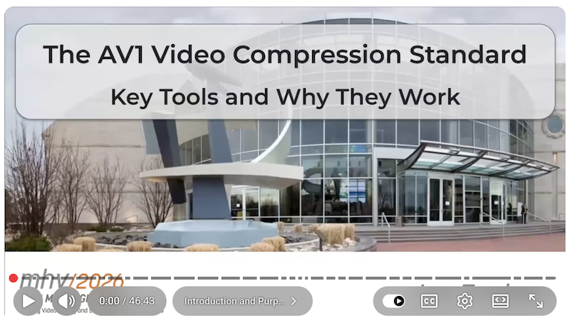

### Hi there  I'm Luc Trudeau

🧪 This is where I experiment with video compression research.

Some of it becomes open-source tools.

### About me

I’m a Canadian🇨🇦 video compression researcher and independent consultant.  
I’ve worked on AV1, contributed to dav1d, and spent years thinking about how to make codecs faster, simpler, and better.

I care about:
- Efficient compression algorithms
- Practical implementations
- Bridging research and production systems

### What I work on

- Codec research and optimization  
- Objective quality metrics
- Fast algorithms for encoding and decoding  
- Experimental learned image/video compression  

Most projects here start as research experiments.  
Some grow into production-ready tools.

### Talks & Tutorials

#### AV1 Tutorial — Mile High Video 2026
Deep dive into AV1 structure and compute vs compression tradeoffs.

  

### Open to

- Research collaborations (academia & industry)
- Codec consulting and performance optimization
- Conference talks and technical tutorials
- Open-source R&D partnerships
